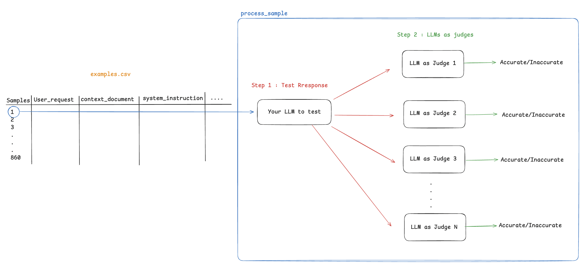

# Facts Grounding implementation

## Overview
This repository implements a framework for evaluating Language Models (LLMs) using judge models. The system consists of two main components:
1. **Test LLMs** - These models generate responses based on user queries.
2. **Judge LLMs** - These models evaluate the accuracy and quality of test model responses.

This implementation is based on the paper ["Facts-Grounding: A New Benchmark for Evaluating the Factuality of Large Language Models"](https://arxiv.org/abs/2501.03200). You can also refer to the related [DeepMind blog post](https://deepmind.google/discover/blog/facts-grounding-a-new-benchmark-for-evaluating-the-factuality-of-large-language-models/) for a more detailed discussion on the methodology and findings.



## Features
- Utilizes LangChain for making API calls to various LLM providers.
- Supports local model inference through Ollama (Llama 3.2 used in this implementation).
- Calls test models to generate responses for user queries.
- Uses judge models to assess the test model responses against provided context documents.
- Supports multiple judge models for a more reliable evaluation.
- Leverages LangSmith for logging results, tracing, and performance monitoring.
- Saves results in JSONL format for easy analysis.

## Setup Instructions
### 1. Install Dependencies
Ensure you have Python installed. Then, install required dependencies:
```bash
pip install -r requirements.txt
```

### 2. Set Up Environment
Make sure to define environment variables or configurations required for model initialization. This can be done by modifying `utils.py` and `models.yaml`.

The application requires:
- LangChain environment variables for API connections
- LangSmith API key for result logging and tracing
- Google Cloud credentials for Vertex AI (if using Google models)

You can set these up in a `.env` file at the root of the project.

#### Using Ollama for Local Models
This implementation uses Llama 3.2 through Ollama for local inference. To use this or any other model locally:

1. Install Ollama from [ollama.ai](https://ollama.ai)
2. Pull the desired model:
```bash
ollama pull llama3.2
```
3. Configure the model in your `models.yaml` file

You can replace llama3.2 with any other model supported by Ollama according to your requirements.

### 3. Run the Script
To execute the evaluation pipeline:
```bash
python main.py
```

## Code Explanation
### `pipeline.py`
- **LLM Class**: Uses LangChain to call a specified LLM model and retrieves responses.
- **JudgeLLM Class**: Uses a list of judge models to evaluate test model outputs.

### `main.py`
- Loads test and judge models from `models.yaml`.
- Iterates through sample prompts in `examples.csv`.
- Calls test models to generate responses via LangChain.
- Uses judge models to evaluate the responses.
- Logs interactions and results using LangSmith.
- Stores the results in JSONL format.

## Output
- `test_responses.jsonl`: Stores responses from test models.
- `judge_responses.jsonl`: Stores evaluations from judge models.
- LangSmith dashboard: Contains detailed traces and analytics of model calls.

## Customization
- Modify `models.yaml` to change test and judge models.
- Update `examples.csv` with new sample queries.
- Adjust `evaluation_prompts.csv` for different evaluation criteria.
- Configure LangSmith settings for custom tracing and evaluation.
- Add different Ollama models by pulling them and updating the configuration.

## License
This project is licensed under the MIT License. See the [LICENSE](LICENSE) file for more details.